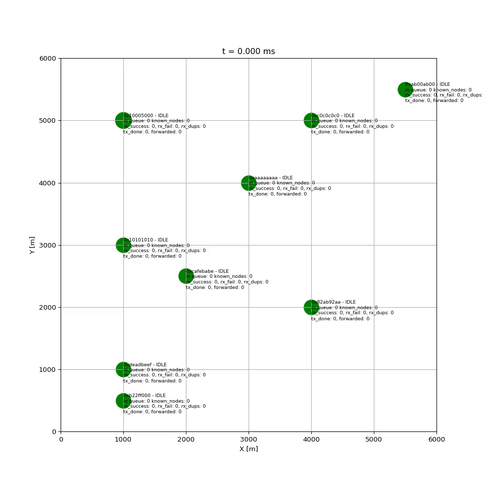

# KSSM - Yet Another Mesh network Simulator 
## 🇵🇱 Kolejny Symulator Sieci Mesh

KSSM is yet another mesh network simulator, but its goal is to demonstrate how mesh networks work. KSSM tries to imitate [Meshtastic network](https://meshtastic.org/).

Why another simulator? Because I can :-)

This is a very early version. Many features are not well thought out yet. It may (or may not) evolve over time.

## Currently working features and their limitations
- nodes are generating messages with very random lenght,
- nodes can repeat messages,
- simplified CSMA/CA algorithm, still not related to real values used by real Meshtastic nodes,
- simple collision detection,
- very simple propagation model,
- output as mp4 and csv.

## Details explained
### tx_time calculation
The time needed to transmit a message over LoRa is calculated with the method published in [Lora Modem Designer's Guide](https://github.com/meshtastic/meshtastic/blob/master/static/documents/LoRa_Design_Guide.pdf) and [Meshtastic source code](https://github.com/meshtastic/firmware/blob/1e4a0134e6ed6d455e54cd21f64232389280781b/src/mesh/RadioInterface.cpp#L201).
For *LONG_FAST* modem preset, the SF = 11, BW = 250000 Hz and symbol_time = 8192 µs. For *MEDIUM_FAST* modem preset, the SF= 9, BW = 250000 Hz and symbol_time = 2048 µs.

## Requirements
- ffmpeg,
- python 3.7+,
- numpy, matplotlib.

## Usage example
```
$ python3 kssm.py [--simulation_time=10] [--time_resolution=1000] [--out_name=kssm.mp4] [--slowmo_factor=5] [--csv_name=file.csv]
```
Options:
- `--simulation_time=N` - length of the simulation in seconds,
- `--time_resolution=N` - time between the events in microseconds,
- `--out_name=out.mp4` - name of the output video file,
- `--slowmo_factor=N` - slowdown factor of the output video file,
- `--csv_name=file.csv` - name of the csv file with the messages history.

## TODO
* [x] tx_time
* [x] rx_time
* [x] backoff_time
* [x] tx_origin
* [ ] node description in easy to edit format (json?)
* [x] number of collisions caused by the node
* [ ] state-time plot
* [ ] directional characteristics of antennas
* [ ] separating the data link and network layer logic into separate methods
* [ ] backoff calculation regarding the node role
* [ ] repeater role
* [ ] easy way to change propagation model
* [ ] coexistence of nodes working on different frequencies and LoRa modem presets



