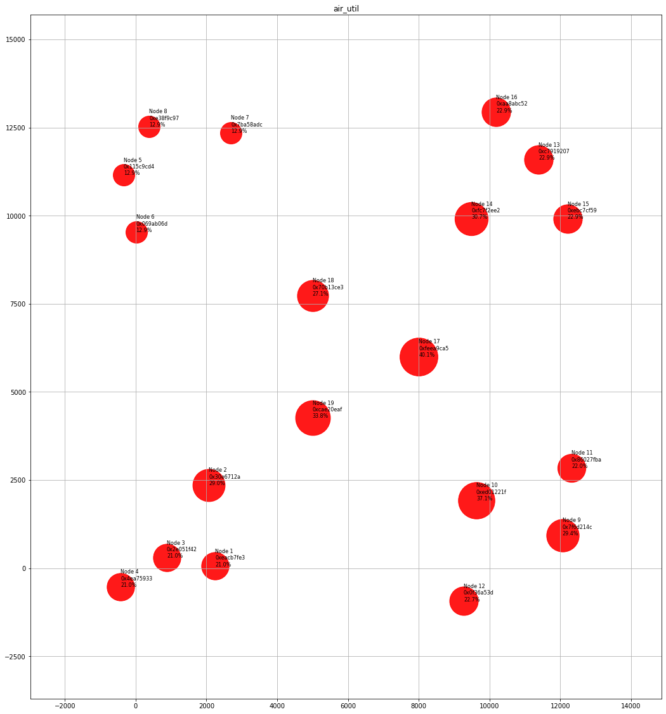
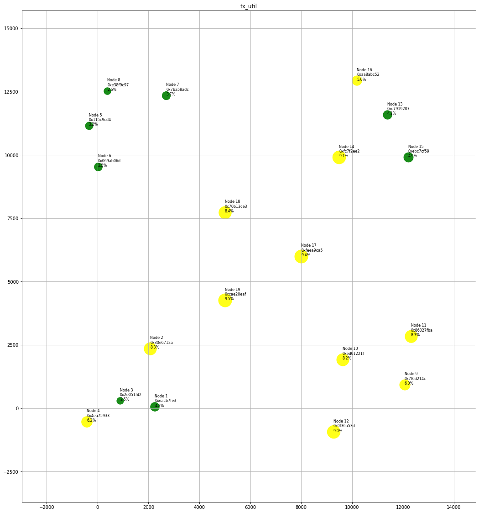
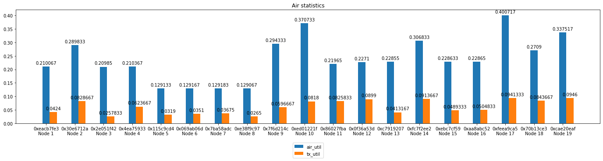
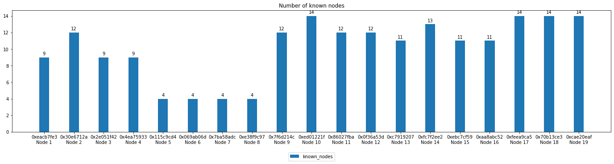
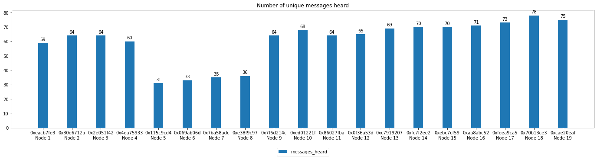
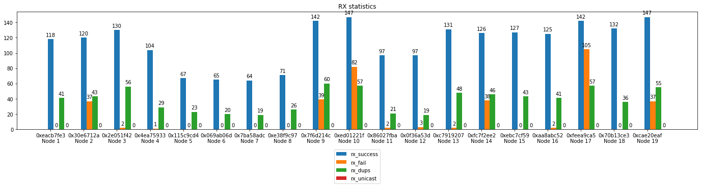
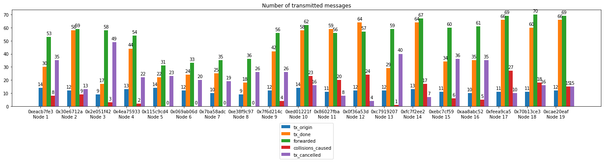
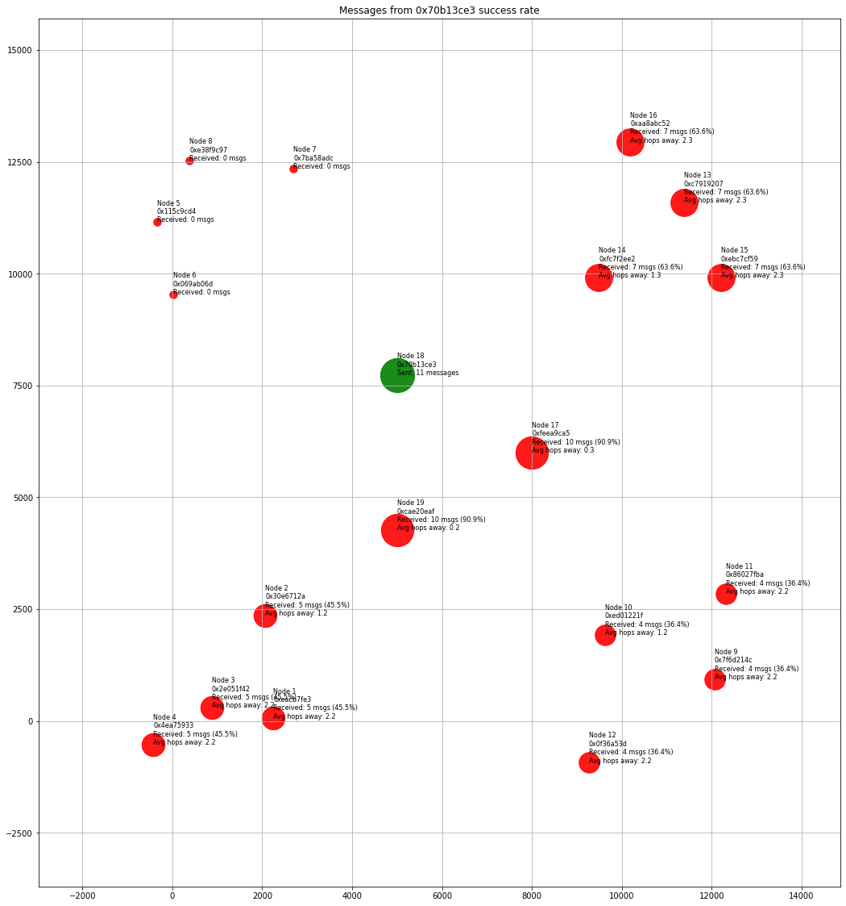

# KSSM - Yet Another Mesh network Simulator 
## 🇵🇱 Kolejny Symulator Sieci Mesh

KSSM is yet another mesh network simulator, but its goal is to demonstrate how mesh networks work. KSSM tries to imitate [Meshtastic network](https://meshtastic.org/).

Why another simulator? Because I can :-)

This is a very early version. Many features are not well thought out yet. It may (or may not) evolve over time.

## Currently working features and their limitations
- nodes are generating messages with very random lenght,
- nodes can repeat messages,
- CSMA/CA algorithm, related to real values used by real Meshtastic nodes,
- simple collision detection,
- very simple propagation model,
- station "range" is calculated with processing gain, so different Modem Presets result in different range,
- output as png, mp4 and csv.

## Requirements
- ffmpeg,
- python 3.7+,
- numpy, matplotlib.

## Usage
```
$ python3 kssm.py --nodes_data=nodes.json 
[--simulation_time=10]
[--time_resolution=1000]
[--results_dir=output_dir]
[--png]
[--mp4]
[--slowmo_factor=5]
[--dpi=200]
```
Options:
- `--nodes_data=nodes.json` - **required**, JSON file with description about nodes, the example JSON structure is in `examples` directory,
- `--simulation_time=N` - length of the simulation in seconds (default 10 s),
- `--time_resolution=N` - time between the events in microseconds (default 1000 µs),
- `--results_dirr=output_dir` - path to the directory where the results will be stored (default ./kssm/),
- `--png` - turn on generating PNG files with the current state of the network with every change of state,
- `--mp4` - turn on generating MP4 video from the PNG files (automatically turns on `--png`)
- `--slowmo_factor=N` - slowdown factor of the output video file (default 5),
- `--dpi=200` - change the DPI size of PNG and MP4 (default 200).

## Metrics explained
The KSSM calculates some metrics that describe network parameters. These metrics are presented in plots and stored in CSV files. The metrics are:
1. *air_util* - the percentage of the time the node was in on of these states: RX_BUSY and TX_BUSY; in other words this is the percentage of the time the medium was busy;
2. *tx_util* - the percentage of the time that the node was transmitting (TX_BUSY state);
3. *Number of known nodes* - the number of unique source node_ids registered in received frames;
4. *Number of messages heard* - the number of unique messages the node received;
5. *Normalized success rate* - this metric is calculated as 
$$normalized\\_success\\_rate = \frac{confirmed\\_messages}{tx\\_origin \cdot (number\\_of\\_nodes - 1)}$$
When the node successfuly receives the message for the first time, the source's *confirmed_messages* metrics is incremented. Every message can be confirmed by all nodes (except the source node) in the map.
6.  *rx_success* - number of successfuly ended receptions, this metric counts every received message (echos of our own, duplicates);
7.  *rx_fail* - number of times the reception failed because of collision;
8.  *rx_dups* - number of received duplicated messages;
9.  *rx_unicast* - number of received messages that the node was the destination;
10.  *tx_origin* - number of messages the node was the source;
11.  *tx_done* - number of times the node was transmitting messages (own or relayed);
12.  *forwarded* - number of messages that were forwarded by the node (the node was not the origin);
13.  *collisions_caused* - number of collisions caused by the node's transmission activity, collisions are counted for every node affected by the collision;
14.  *tx_cancelled* - number of times the node cancelled relaying, despite the fact the node was originally intended to relay, but heard another copy of this message;

There are also available the plots of success rate for every node. Every other node has printed the number of received messages originated from the inspected node. Every received message has also registered the number of used hops and the average *hops away* metrics is also calculated.

## Some details explained
### tx_time calculation
The time needed to transmit a message over LoRa is calculated with the method published in [Lora Modem Designer's Guide](https://github.com/meshtastic/meshtastic/blob/master/static/documents/LoRa_Design_Guide.pdf) and [Meshtastic source code](https://github.com/meshtastic/firmware/blob/1e4a0134e6ed6d455e54cd21f64232389280781b/src/mesh/RadioInterface.cpp#L201).
The symbol time is calculated with the formula $$symbol\\_time = \frac{2^{SF}}{BW}$$
Symbol time for some modem presets:
- *LONG_FAST* (SF = 11, BW = 250000 Hz) - symbol_time = 8192 µs
- *MEDIUM_FAST* (SF = 9, BW = 250000 Hz) - symbol_time = 2048 µs
- *SHORT_FAST* (SF = 7, BW = 250000 Hz) - symbol_time = 512 µs
- *VERY_LONG_SLOW* (SF = 12, BW = 62500 Hz) - symbol_time = 65536 µs
- *SHORT_TURBO* (SF = 7, BW = 500000 HZ) - symbol_time = 256 µs

### Signal to Noise Ration (SNR) calculation
This problem is simplified as there is no need to simulate the hardware and the whole communication channel. The SNR is calculated with the formula: $$SNR = P_{signal} - P_{noise}$$ where $$P_{signal}$$ is the RSSI of the signal (dBm) and $$P_{noise}$$ is the power of the background noise (dBm). The RSSI is calculated with simple propagation model. The background noise level (power) is just a parameter of the node (default: -100 dBm). The background noise level is constant during the simulation (it may change in future). When $$SNR > -1 \cdot PG$$ (PG - *processing gain*), then it is considered as "*station in range*".

### Processing gain
Different LoRa settings result in different "range". For the same antennas and the same tx_power we can have further range by changing SF (*Spreading Factor*) and CR (*Coding Rate*) parameters in exchange for longer time needed for the transmission.

The *processing gain* (PG) is calculated as:

$$PG = 10 \cdot log_{10}(\frac{2^{SF}}{SF}) - 10 \cdot log_{10}(\frac{CR}{4})$$

where:
- SF is the Spreading Factor (7 to 12),
- CR is the cummulative number of bits used for coding 4 informational bits (5 - 8).

### Backoff time calculation
Backoff time (contention window) is the random time the station waits before transmission start. This time is calculated in a few different ways. The important values are:
- CWmin = 3
- CWmax = 8
- $$slot\\_time = 2.5 \cdot symbol\\_time + 7.6\cdot 10^{-3}$$
#### For the message we are the source
To calculate the backoff time in this case we need to know the current *air utilization* - the percentage of time the medium was used (we were transmitting or receiving). Then we need to "map" this percentage value (from 0 to 100) to the range <CWmin, CWmax>:

$$CWsize = \frac{airutil}{100} \cdot (CW_{max} - CW_{min}) + CW_{min}$$

The backoff time is the random value from the range $$<0, 2^{CWsize}>$$ multiplied by symbol_time:
$$backoff\\_time = random(0, 2^{CWsize}) \cdot symbol\\_time$$
#### For the message we are only relaying
The backoff time for this case is calculated in two ways, regarding the role of the relaying node. In both cases the backoff_time is related to SNR (signal-to-noise ratio) measured during receiving the message to be relayed. The SNR should be in range <-20, +10> and this value is mapped to the range <CWmin, CWmax>:

$$CWsize = \frac{SNR + 20}{30} \cdot (CW_{max} - CW_{min}) + CW_{min}$$

Then the backoff time is calculated as:
- for ROUTER and REPEATER: $$backoff\\_time = random(0, 2^{CWsize}) \cdot slot\\_time$$
- for CLIENT and ROUTER_LATE (if no duplicate message was received): $$backoff\\_time = 2 CWmax \cdot slot\\_time + random(0, 2^{CWsize}) \cdot slot\\_time$$
- for ROUTER_LATE when the message intended to relay was received more once: $$backoff\_time = 2CWmax \cdot slot\_time + 2^{CWsize} \cdot slot\_time$$

As you can see, the ROUTER and the REPEATER will retransmit the message earlier than CLIENT. In both cases, the station that received the message with lower SNR (we can assume it means the station was further from the source) will retransmit the message earlier.
### Message relay rules
- ROUTER or REPEATER: relays message always,
- CLIENT: will not relay the message if the message was heard at least two times (relayed by other stations)
## TODO
* [x] tx_time
* [x] rx_time
* [x] backoff_time
* [x] tx_origin
* [x] node description in easy to edit format (json?)
* [x] number of collisions caused by the node
* [ ] state-time plot
* [ ] directional characteristics of antennas
* [ ] separating the data link and network layer logic into separate methods
* [x] backoff calculation regarding the node role
* [ ] waiting for ACK (the source of the message waits for the message to be repeated by other node and may send the message again)
* [x] AirUtil, TxUtil
* [x] summarized bar plots at the end of simulation
* [ ] easy way to change propagation model
* [ ] coexistence of nodes working on different frequencies and LoRa modem presets
* [ ] a little bit more smart doing things (optimization)
* [x] REPEATER
* [x] CLIENT_MUTE
* [x] CLIENT_HIDDEN
* [x] ROUTER_LATE
* [ ] machine-readable results

## Example results

https://github.com/user-attachments/assets/7bcf5927-d4e9-4b02-8332-fba0da0bcaa3










