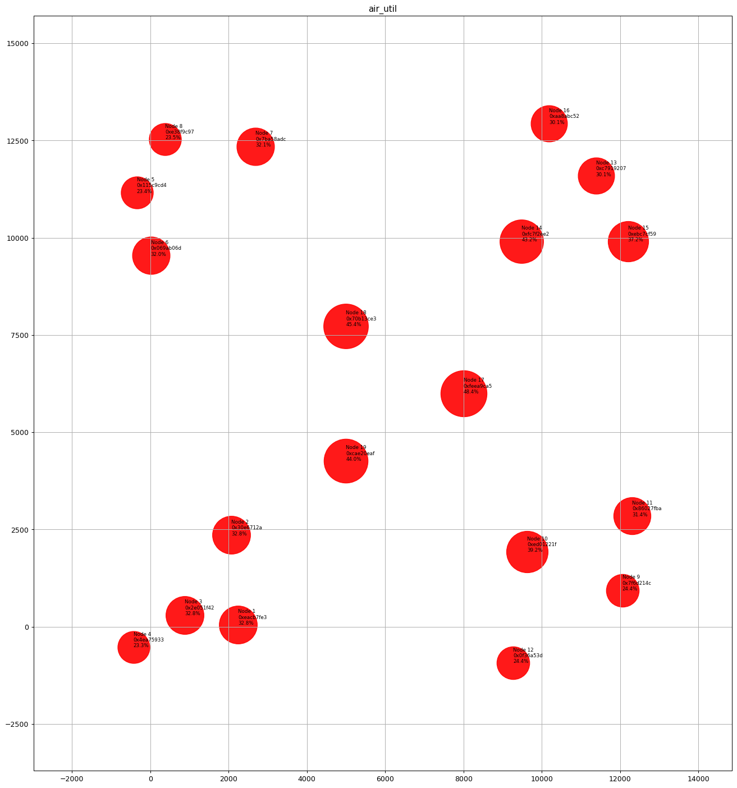
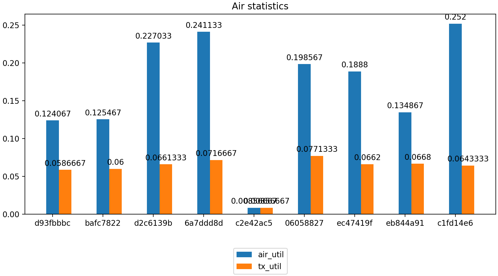
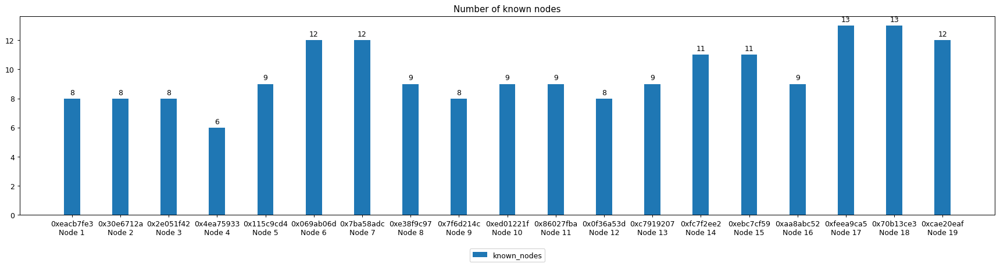
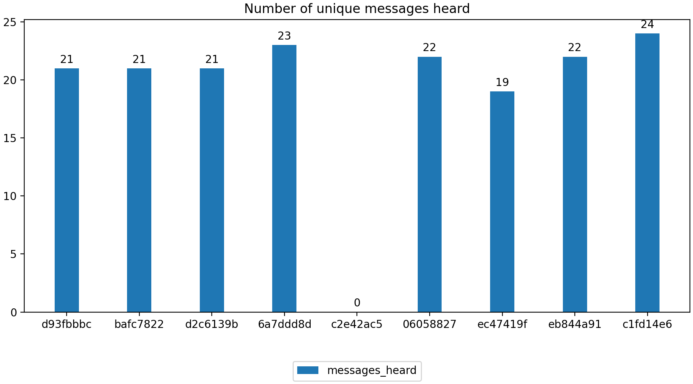
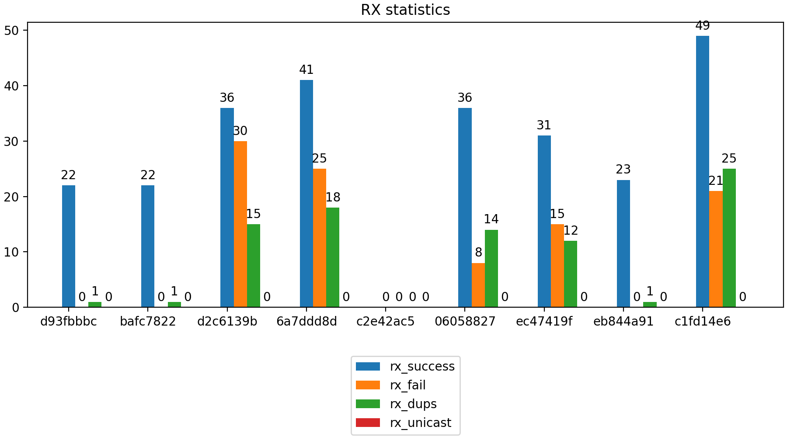
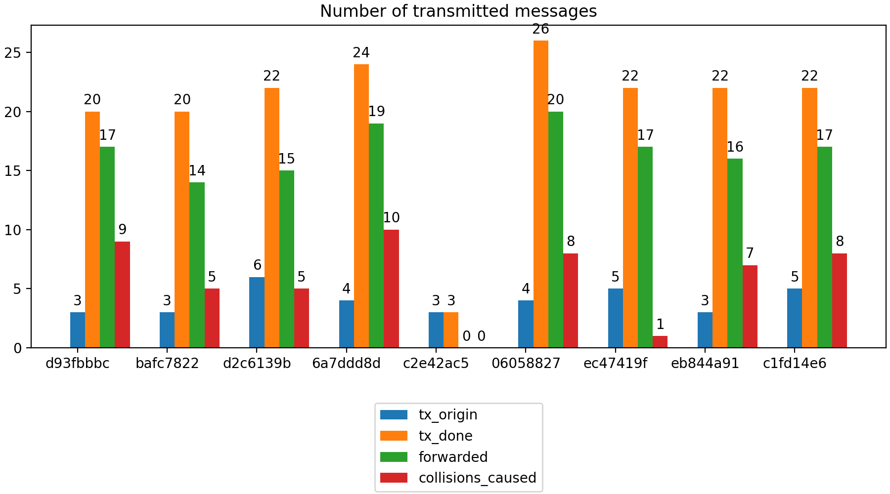

# KSSM - Yet Another Mesh network Simulator 
## 🇵🇱 Kolejny Symulator Sieci Mesh

KSSM is yet another mesh network simulator, but its goal is to demonstrate how mesh networks work. KSSM tries to imitate [Meshtastic network](https://meshtastic.org/).

Why another simulator? Because I can :-)

This is a very early version. Many features are not well thought out yet. It may (or may not) evolve over time.

## Currently working features and their limitations
- nodes are generating messages with very random lenght,
- nodes can repeat messages,
- CSMA/CA algorithm, related to real values used by real Meshtastic nodes,
- simple collision detection,
- very simple propagation model,
- output as mp4 and csv.

## Some details explained
### tx_time calculation
The time needed to transmit a message over LoRa is calculated with the method published in [Lora Modem Designer's Guide](https://github.com/meshtastic/meshtastic/blob/master/static/documents/LoRa_Design_Guide.pdf) and [Meshtastic source code](https://github.com/meshtastic/firmware/blob/1e4a0134e6ed6d455e54cd21f64232389280781b/src/mesh/RadioInterface.cpp#L201).
For *LONG_FAST* modem preset, the SF = 11, BW = 250000 Hz and symbol_time = 8192 µs. For *MEDIUM_FAST* modem preset, the SF = 9, BW = 250000 Hz and symbol_time = 2048 µs.

### Signal to Noise Ration (SNR) calculation
This problem is simplified as there is no need to simulate the hardware and the whole communication channel. 

The SNR is calculated with the formula: $ SNR = P_{signal} - P_{noise} $ where $ P_{signal} $ is the RSSI of the signal (dBm) and $ P_{noise} $ is the power of the background noise (dBm). The RSSI is calculated with simple propagation model. The background noise level (power) is just a parameter of the node (default: -100 dBm). The background noise level is constant during the simulation (it may change in future). When SNR > -20 dB, then it is considered as "*station in range*".

## Requirements
- ffmpeg,
- python 3.7+,
- numpy, matplotlib.

## Usage
```
$ python3 kssm.py --nodes_data=nodes.json 
[--simulation_time=10]
[--time_resolution=1000]
[--png_out_dir=output_dir]
[--mp4_name=kssm.mp4]
[--slowmo_factor=5]
[--results_prefix=./kssm-]
```
Options:
- `--nodes_data=nodes.json` - **required**, JSON file with description about nodes, the example JSON structure is in `examples` directory,
- `--simulation_time=N` - length of the simulation in seconds (default 10 s),
- `--time_resolution=N` - time between the events in microseconds (default 1000 µs),
- `--png_out_dir=output_dir` - path to the directory where the PNG files will be stored (default None),
- `--mp4_name=out.mp4` - name of the output video file, mp4 file will be generated only if this option has been given, requires `--png_out_dir` (default None),
- `--slowmo_factor=N` - slowdown factor of the output video file (default 5),
- `--results_prefix=./kssm-` - prefix (may contain the path) of result csv files (*prefix-messages.csv* and *prefix-nodes.csv*) (default ./kssm-).

## TODO
* [x] tx_time
* [x] rx_time
* [x] backoff_time
* [x] tx_origin
* [x] node description in easy to edit format (json?)
* [x] number of collisions caused by the node
* [ ] state-time plot
* [ ] directional characteristics of antennas
* [ ] separating the data link and network layer logic into separate methods
* [x] backoff calculation regarding the node role
* [ ] repeater role
* [ ] waiting for ACK (receiving of retransmitted message from me)
* [x] AirUtil, TxUtil
* [x] summarized bar plots at the end of simulation
* [ ] easy way to change propagation model
* [ ] coexistence of nodes working on different frequencies and LoRa modem presets
* [ ] a little bit more smart doing things (optimization)

## Example results










